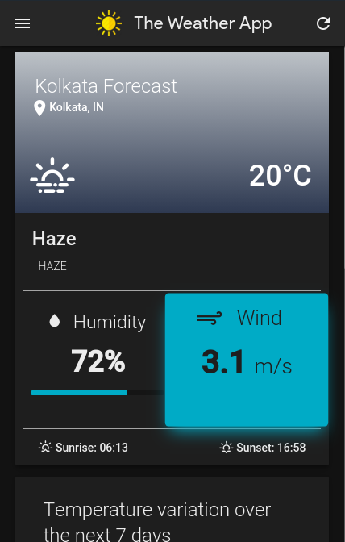
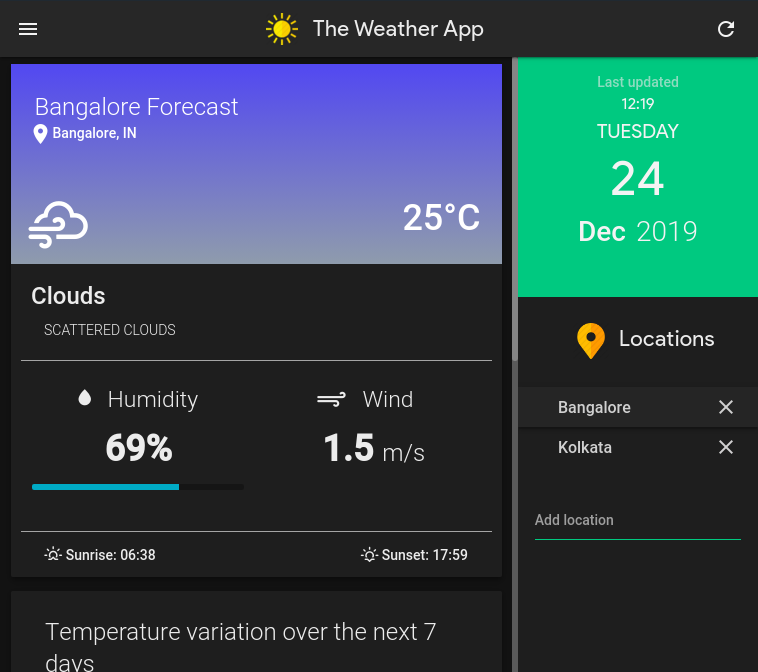
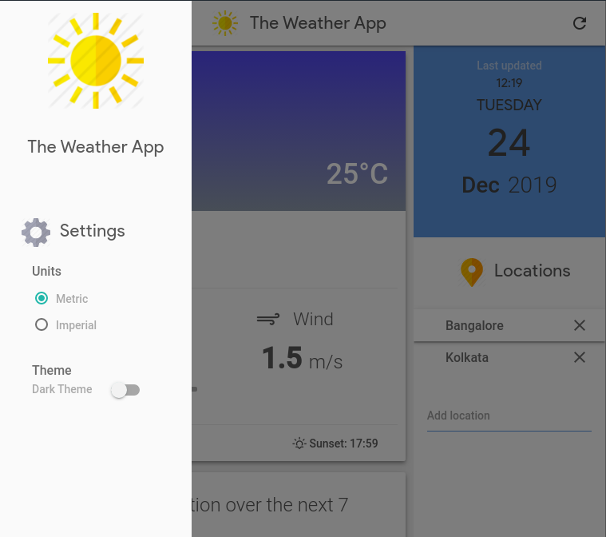
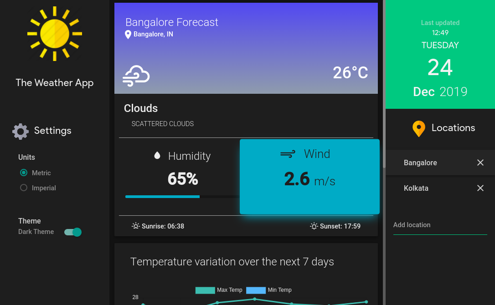
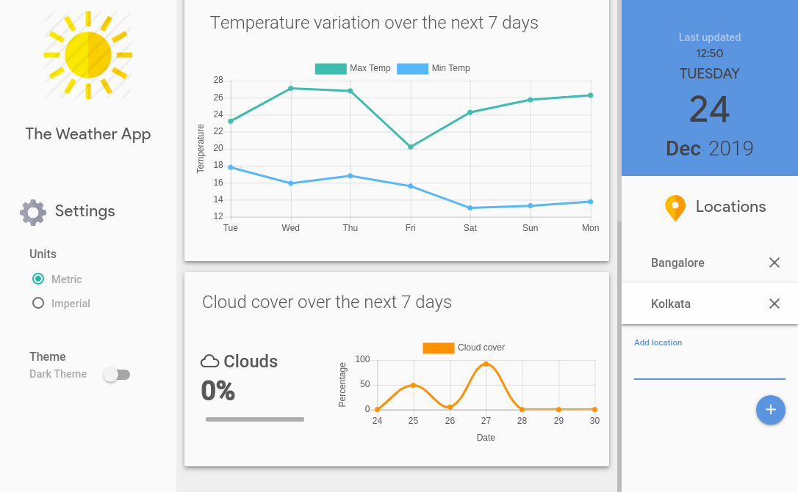

# The Weather App

A simple material design Weather website with basic PWA features.

## Showcase

|                Dark Theme              |                Light Theme              |
|:-:|:-:|
|   |    |
|   |    |
|   |    |

## Credits

- [OpenWeatherMaps](https://openweathermap.org/)
- [Materialize](https://materializecss.com/)
- [Material Design Lite](https://getmdl.io/)
- Icons made by [Freepik](https://www.flaticon.com/authors/freepik) from www.flaticon.com.
